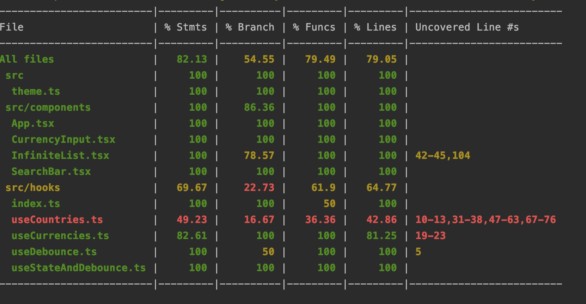

# Country Search App

This project was bootstrapped with [Create React App](https://github.com/facebook/create-react-app).

## Demo

## Test coverage

## Available Scripts

In the project directory, you can run:

### `yarn start`

Runs the app in the development mode.\
Open [http://localhost:3000](http://localhost:3000) to view it in the browser.

### `yarn jest`

Runs the unit tests.\
Open [http://localhost:3000](http://localhost:3000) to view it in the browser.

## Todos
- [ ] Write unit tests for useCountries and useCurrencies custom hook
- [ ] Write end to end tests
- [ ] Integrate react-query for separating async state from global state
